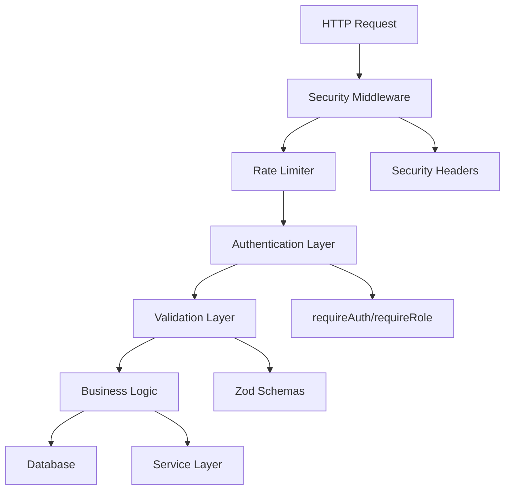
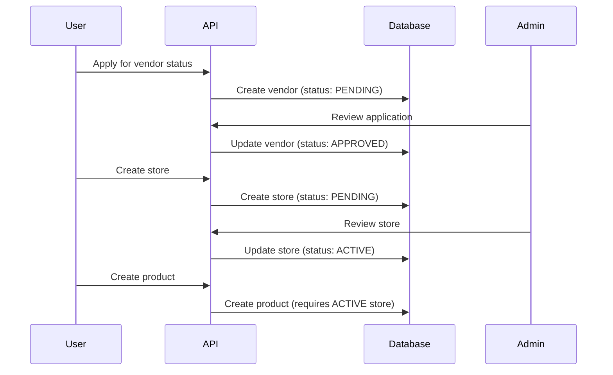

# Design Document

## Overview

This design document outlines the technical approach for cleaning up the Bidinsouk platform's foundation. The cleanup addresses five critical areas that currently pose security risks, maintainability challenges, and business logic violations. The design follows a systematic approach to remove technical debt while ensuring all existing functionality continues to work correctly.

The cleanup is structured as five independent but complementary components, each addressing a specific category of technical debt. The design prioritizes security fixes first, followed by data integrity improvements, and concludes with business logic enforcement.

## Architecture

### Current State Analysis

The codebase currently exhibits the following architectural issues:

1. **Dual Authentication Patterns**: Mock header-based authentication coexists with proper NextAuth-based authentication
2. **Weak Type Safety**: Validation schemas use `z.any()` which bypasses TypeScript's type checking
3. **Business Logic Bypass**: Auto-creation patterns circumvent intended vendor approval workflows
4. **Documentation Sprawl**: 70+ markdown files create confusion about actual project state
5. **Missing Security Layer**: No rate limiting or security headers protect the application

### Target State Architecture

The cleaned-up architecture will feature:

1. **Unified Authentication**: Single authentication pattern using NextAuth JWT tokens
2. **Strong Type Safety**: All validation schemas use explicit types matching database schema
3. **Enforced Business Logic**: Vendor workflows require proper application and approval
4. **Organized Documentation**: Single source of truth with archived historical documents
5. **Security Middleware**: Rate limiting and security headers protect all endpoints

### Component Interaction Diagram



## Components and Interfaces

### Component 1: Documentation Organization

**Purpose**: Establish clear documentation structure and single source of truth

**Implementation Strategy**:
- Create archive directory structure
- Move historical documents programmatically
- Generate consolidated status document
- Update README with accurate metrics

**File Structure**:
```
/docs/
  /archive/
    /fixes/          # All *FIX*.md files
    /summaries/      # All *SUMMARY*.md files
    /guides/         # Historical guides
  CURRENT_STATUS.md  # Single source of truth
README.md            # Updated with accurate status
```

**Status Document Schema**:
```typescript
interface CurrentStatus {
  lastUpdated: string
  backendCompletion: number  // Actual percentage
  frontendCompletion: number // Actual percentage
  criticalIssues: string[]
  inProgress: string[]
  nextSteps: string[]
}
```

### Component 2: Authentication Security

**Purpose**: Remove mock authentication and enforce proper JWT-based authentication

**Current Pattern (To Remove)**:
```typescript
function getCurrentUser(req: NextRequest) {
  const userId = req.headers.get('x-user-id')
  const vendorId = req.headers.get('x-vendor-id')
  const role = req.headers.get('x-user-role')
  if (!userId) return null
  return { userId: BigInt(userId), vendorId, role }
}
```

**Target Pattern (To Implement)**:
```typescript
import { requireAuth, requireRole } from '@/lib/auth/api-auth'

// For authenticated endpoints
const user = await requireAuth(req)

// For role-based endpoints
const user = await requireRole(req, ['VENDOR', 'ADMIN'])
```

**Affected Files** (30+ API routes):
- `app/api/vendors/**/*.ts` (8 files)
- `app/api/vendor/**/*.ts` (7 files)
- `app/api/admin/**/*.ts` (12 files)
- `app/api/saved-searches/**/*.ts` (2 files)
- `app/api/products/[id]/reviews/route.ts`
- `app/api/notifications/[id]/read/route.ts`
- `app/api/banners/**/*.ts` (2 files)
- `app/api/abuse-reports/**/*.ts` (2 files)

**Error Handling Pattern**:
```typescript
try {
  const user = await requireAuth(req)
  // ... business logic
} catch (error) {
  if (error.message === 'Unauthorized') {
    return NextResponse.json(
      { error: 'Authentication required' },
      { status: 401 }
    )
  }
  if (error.message === 'Forbidden') {
    return NextResponse.json(
      { error: 'Insufficient permissions' },
      { status: 403 }
    )
  }
  throw error
}
```

**Migration Strategy**:
1. Identify all files using mock authentication (completed via grep search)
2. Replace `getCurrentUser()` with `requireAuth()` or `requireRole()`
3. Update error handling to use try-catch pattern
4. Remove `getCurrentUser()` function definitions
5. Test each endpoint with proper authentication

### Component 3: Validation Schema Integrity

**Purpose**: Ensure all validation schemas use proper types and match database constraints

**Current Issues**:
1. `z.any()` usage in products and messages schemas
2. Schemas don't match database field requirements
3. Optional fields used incorrectly

**Target Schema Patterns**:

**Products Validation** (lib/validations/products.ts):
```typescript
// Current (problematic)
attributes: z.record(z.any()).optional()

// Target (type-safe)
attributes: z.record(z.string(), z.union([
  z.string(),
  z.number(),
  z.boolean()
])).optional()
```

**Messages Validation** (lib/validations/messages.ts):
```typescript
// Current (problematic)
attachments: z.any().optional()

// Target (type-safe)
attachments: z.array(z.object({
  filename: z.string(),
  url: z.string().url(),
  size: z.number(),
  mimeType: z.string()
})).optional()
```

**Validation Principles**:
1. Never use `z.any()` - always specify explicit types
2. Match database schema exactly (check prisma/schema.prisma)
3. Use `.optional()` only when database allows NULL
4. Use `.default()` for fields with database defaults
5. Add proper min/max constraints matching database
6. Use enums for fields with limited values

**Database Schema Reference**:
```prisma
// From prisma/schema.prisma
model Product {
  id          BigInt   @id @default(autoincrement())
  storeId     BigInt
  title       String   @db.VarChar(255)
  description String?  @db.Text
  brand       String?  @db.VarChar(100)
  category    String?  @db.VarChar(100)
  condition   Condition @default(USED)
  images      Json?
  attributes  Json?
  // ...
}
```

**Validation Testing Strategy**:
- Test with valid data (should pass)
- Test with invalid types (should fail)
- Test with missing required fields (should fail)
- Test with out-of-range values (should fail)
- Test with null values for optional fields (should pass)

### Component 4: Business Logic Enforcement

**Purpose**: Remove auto-creation patterns and enforce proper vendor workflows

**Current Auto-Creation Pattern** (To Remove):
```typescript
// From app/api/vendors/products/route.ts
let vendor = user?.vendor;
if (!vendor) {
  vendor = await prisma.vendor.create({
    data: { userId: userId },
    include: { stores: true }
  });
}

let store = vendor.stores[0];
if (!store) {
  store = await prisma.store.create({
    data: {
      sellerId: vendor.id,
      name: 'Ma Boutique',
      slug: `store-${Date.now()}-${userId}`,
      email: user?.email || 'vendor@example.com',
      status: 'ACTIVE'
    }
  });
}
```

**Target Pattern** (Enforce Workflow):
```typescript
// Require vendor status
const user = await requireRole(req, ['VENDOR', 'ADMIN'])

// Get vendor profile (must exist)
const vendor = await prisma.vendor.findUnique({
  where: { userId: BigInt(user.userId) },
  include: { stores: true }
})

if (!vendor) {
  return NextResponse.json(
    { 
      error: 'Vendor profile required',
      message: 'Please complete vendor application first'
    },
    { status: 403 }
  )
}

// Require at least one approved store
const activeStore = vendor.stores.find(s => s.status === 'ACTIVE')
if (!activeStore) {
  return NextResponse.json(
    { 
      error: 'Active store required',
      message: 'Please create and get approval for a store first'
    },
    { status: 403 }
  )
}
```

**Affected Files**:
- `app/api/vendors/products/route.ts` (2 instances)
- `app/api/vendors/settings/route.ts` (1 instance)
- `app/api/auctions/route.ts` (1 instance)

**Proper Vendor Workflow**:


**Error Messages**:
- No vendor profile: "Vendor profile required. Please complete vendor application first."
- No active store: "Active store required. Please create and get approval for a store first."
- Pending vendor: "Vendor application pending. Please wait for admin approval."
- Pending store: "Store approval pending. Please wait for admin approval."

### Component 5: Security Middleware

**Purpose**: Add rate limiting and security headers to protect the application

**Rate Limiting Strategy**:

**Implementation Approach**:
Since Next.js doesn't have built-in rate limiting, we'll implement a simple in-memory rate limiter for development and recommend Redis-based solution for production.

**Rate Limiter Utility** (lib/security/rate-limiter.ts):
```typescript
interface RateLimitConfig {
  windowMs: number      // Time window in milliseconds
  maxRequests: number   // Max requests per window
}

interface RateLimitStore {
  [key: string]: {
    count: number
    resetTime: number
  }
}

class RateLimiter {
  private store: RateLimitStore = {}
  
  check(identifier: string, config: RateLimitConfig): {
    allowed: boolean
    remaining: number
    resetTime: number
  } {
    const now = Date.now()
    const record = this.store[identifier]
    
    // Clean up expired records
    if (record && now > record.resetTime) {
      delete this.store[identifier]
    }
    
    // Initialize or get current record
    const current = this.store[identifier] || {
      count: 0,
      resetTime: now + config.windowMs
    }
    
    // Check limit
    if (current.count >= config.maxRequests) {
      return {
        allowed: false,
        remaining: 0,
        resetTime: current.resetTime
      }
    }
    
    // Increment and store
    current.count++
    this.store[identifier] = current
    
    return {
      allowed: true,
      remaining: config.maxRequests - current.count,
      resetTime: current.resetTime
    }
  }
}

export const rateLimiter = new RateLimiter()
```

**Rate Limit Configurations**:
```typescript
export const RATE_LIMITS = {
  auth: {
    windowMs: 15 * 60 * 1000,  // 15 minutes
    maxRequests: 5              // 5 attempts
  },
  api: {
    windowMs: 15 * 60 * 1000,  // 15 minutes
    maxRequests: 100            // 100 requests
  },
  strict: {
    windowMs: 15 * 60 * 1000,  // 15 minutes
    maxRequests: 10             // 10 requests (for sensitive operations)
  }
}
```

**Rate Limit Middleware** (lib/security/middleware.ts):
```typescript
import { NextRequest, NextResponse } from 'next/server'
import { rateLimiter, RATE_LIMITS } from './rate-limiter'

export function withRateLimit(
  handler: Function,
  config: RateLimitConfig
) {
  return async (req: NextRequest, ...args: any[]) => {
    // Get identifier (IP address or user ID)
    const identifier = req.ip || 
                      req.headers.get('x-forwarded-for') || 
                      'unknown'
    
    const result = rateLimiter.check(identifier, config)
    
    if (!result.allowed) {
      return NextResponse.json(
        { 
          error: 'Too many requests',
          retryAfter: Math.ceil((result.resetTime - Date.now()) / 1000)
        },
        { 
          status: 429,
          headers: {
            'Retry-After': String(Math.ceil((result.resetTime - Date.now()) / 1000)),
            'X-RateLimit-Limit': String(config.maxRequests),
            'X-RateLimit-Remaining': '0',
            'X-RateLimit-Reset': String(result.resetTime)
          }
        }
      )
    }
    
    // Add rate limit headers to response
    const response = await handler(req, ...args)
    response.headers.set('X-RateLimit-Limit', String(config.maxRequests))
    response.headers.set('X-RateLimit-Remaining', String(result.remaining))
    response.headers.set('X-RateLimit-Reset', String(result.resetTime))
    
    return response
  }
}
```

**Security Headers Middleware** (middleware.ts):
```typescript
import { NextResponse } from 'next/server'
import type { NextRequest } from 'next/server'

export function middleware(request: NextRequest) {
  const response = NextResponse.next()
  
  // Security headers
  response.headers.set('X-Frame-Options', 'DENY')
  response.headers.set('X-Content-Type-Options', 'nosniff')
  response.headers.set('X-XSS-Protection', '1; mode=block')
  response.headers.set('Referrer-Policy', 'strict-origin-when-cross-origin')
  response.headers.set(
    'Permissions-Policy',
    'camera=(), microphone=(), geolocation=()'
  )
  
  // Content Security Policy
  response.headers.set(
    'Content-Security-Policy',
    "default-src 'self'; " +
    "script-src 'self' 'unsafe-inline' 'unsafe-eval'; " +
    "style-src 'self' 'unsafe-inline'; " +
    "img-src 'self' data: https:; " +
    "font-src 'self' data:; " +
    "connect-src 'self' https:;"
  )
  
  return response
}

export const config = {
  matcher: [
    '/((?!_next/static|_next/image|favicon.ico).*)',
  ],
}
```

**Usage in API Routes**:
```typescript
// app/api/auth/login/route.ts
import { withRateLimit } from '@/lib/security/middleware'
import { RATE_LIMITS } from '@/lib/security/rate-limiter'

async function handler(req: NextRequest) {
  // Login logic
}

export const POST = withRateLimit(handler, RATE_LIMITS.auth)
```

## Data Models

No new data models are required for this cleanup. All changes work with existing database schema.

**Relevant Existing Models**:
- User (authentication)
- Vendor (business logic enforcement)
- Store (business logic enforcement)
- Product (validation schemas)
- Message (validation schemas)

## Error Handling

### Standardized Error Response Format

```typescript
interface ErrorResponse {
  error: string           // Short error identifier
  message?: string        // Human-readable message
  details?: any          // Additional error details
  code?: string          // Error code for client handling
}
```

### Error Handling Patterns

**Authentication Errors**:
```typescript
// 401 Unauthorized
{
  error: 'Unauthorized',
  message: 'Authentication required',
  code: 'AUTH_REQUIRED'
}

// 403 Forbidden
{
  error: 'Forbidden',
  message: 'Insufficient permissions',
  code: 'INSUFFICIENT_PERMISSIONS'
}
```

**Validation Errors**:
```typescript
// 400 Bad Request
{
  error: 'Validation failed',
  message: 'Invalid input data',
  details: {
    title: 'Title must be at least 3 characters',
    price: 'Price must be a positive number'
  },
  code: 'VALIDATION_ERROR'
}
```

**Business Logic Errors**:
```typescript
// 403 Forbidden
{
  error: 'Vendor profile required',
  message: 'Please complete vendor application first',
  code: 'VENDOR_REQUIRED'
}

// 403 Forbidden
{
  error: 'Active store required',
  message: 'Please create and get approval for a store first',
  code: 'STORE_REQUIRED'
}
```

**Rate Limit Errors**:
```typescript
// 429 Too Many Requests
{
  error: 'Too many requests',
  retryAfter: 300  // seconds
}
```

### Error Logging

All errors should be logged with appropriate context:

```typescript
console.error('[AUTH_ERROR]', {
  endpoint: req.url,
  method: req.method,
  error: error.message,
  timestamp: new Date().toISOString()
})
```

## Testing Strategy

### Manual Testing Checklist

**Component 1: Documentation**
- [ ] Verify all fix documents moved to archive
- [ ] Verify CURRENT_STATUS.md exists and is accurate
- [ ] Verify README reflects actual completion percentages

**Component 2: Authentication**
- [ ] Test each modified endpoint with valid JWT token (should work)
- [ ] Test each modified endpoint without token (should return 401)
- [ ] Test role-restricted endpoints with wrong role (should return 403)
- [ ] Verify no `x-user-id` headers remain in codebase

**Component 3: Validation**
- [ ] Test product creation with valid data (should succeed)
- [ ] Test product creation with invalid attributes (should fail with clear error)
- [ ] Test message creation with valid attachments (should succeed)
- [ ] Test message creation with invalid attachments (should fail with clear error)
- [ ] Verify no `z.any()` usage remains in validation files

**Component 4: Business Logic**
- [ ] Test product creation without vendor profile (should fail with helpful message)
- [ ] Test product creation without active store (should fail with helpful message)
- [ ] Test product creation with proper vendor and store (should succeed)
- [ ] Verify no auto-creation code remains in API routes

**Component 5: Security**
- [ ] Test rate limiting on auth endpoints (should block after 5 attempts)
- [ ] Test rate limiting on API endpoints (should block after 100 requests)
- [ ] Verify security headers present in all responses
- [ ] Test rate limit reset after window expires

### Testing Tools

**Authentication Testing**:
```bash
# Test with valid token
curl -H "Authorization: Bearer <valid-token>" \
     http://localhost:3000/api/products

# Test without token
curl http://localhost:3000/api/products
```

**Validation Testing**:
```bash
# Test with invalid data
curl -X POST http://localhost:3000/api/products \
     -H "Content-Type: application/json" \
     -d '{"title": "ab", "attributes": "invalid"}'
```

**Rate Limit Testing**:
```bash
# Send multiple requests quickly
for i in {1..10}; do
  curl http://localhost:3000/api/auth/login
done
```

## Migration Plan

### Phase 1: Documentation (Low Risk)
1. Create archive directory structure
2. Move files programmatically
3. Create CURRENT_STATUS.md
4. Update README
5. Commit changes

### Phase 2: Validation Schemas (Low Risk)
1. Update products validation
2. Update messages validation
3. Test with valid and invalid data
4. Commit changes

### Phase 3: Security Middleware (Medium Risk)
1. Create rate limiter utility
2. Create middleware wrapper
3. Add security headers to middleware.ts
4. Test rate limiting
5. Commit changes

### Phase 4: Authentication (High Risk)
1. Update one API route at a time
2. Test each route after update
3. Commit after each successful update
4. Continue until all routes updated

### Phase 5: Business Logic (High Risk)
1. Remove auto-creation from products API
2. Test product creation workflow
3. Remove auto-creation from auctions API
4. Test auction creation workflow
5. Remove auto-creation from settings API
6. Test settings workflow
7. Commit changes

### Rollback Strategy

Each phase should be committed separately. If issues arise:
1. Identify the problematic commit
2. Revert using `git revert <commit-hash>`
3. Fix the issue
4. Re-apply the changes

## Performance Considerations

### Rate Limiter Performance

**In-Memory Store**:
- Pros: Fast, no external dependencies
- Cons: Doesn't work across multiple server instances, lost on restart
- Suitable for: Development and single-instance deployments

**Production Recommendation**:
- Use Redis for distributed rate limiting
- Implement using `ioredis` or `redis` npm package
- Allows rate limiting across multiple server instances

### Validation Performance

Zod validation is fast but adds overhead. Mitigations:
- Cache compiled schemas
- Use `.strict()` only when necessary
- Avoid deeply nested schemas

### Authentication Performance

JWT token verification is fast but involves:
- Token decryption
- Signature verification
- Expiration check

Optimization:
- Cache user data for duration of request
- Use short-lived tokens (15 minutes)
- Implement token refresh mechanism

## Security Considerations

### Authentication Security

**Strengths**:
- JWT tokens are cryptographically signed
- Tokens expire automatically
- Role-based access control enforced

**Remaining Concerns**:
- Token refresh mechanism not implemented (future work)
- No token revocation mechanism (future work)
- Session management could be improved (future work)

### Rate Limiting Security

**Strengths**:
- Prevents brute force attacks
- Mitigates DDoS attempts
- Protects against API abuse

**Limitations**:
- In-memory store can be bypassed by restarting server
- IP-based limiting can be bypassed with proxies
- Needs Redis for production use

### Validation Security

**Strengths**:
- Prevents injection attacks
- Enforces data integrity
- Type-safe validation

**Best Practices**:
- Always validate on server side
- Never trust client input
- Use whitelist approach (explicit types, not `z.any()`)

## Future Enhancements

### Short-term (Next Phase)
1. Add automated tests for all cleaned-up code
2. Implement Redis-based rate limiting
3. Add request logging and monitoring
4. Implement token refresh mechanism

### Long-term (Future Phases)
1. Add CAPTCHA to authentication endpoints
2. Implement IP reputation checking
3. Add anomaly detection for suspicious patterns
4. Implement comprehensive audit logging
5. Add security event alerting

## Dependencies

### Existing Dependencies (No Changes)
- `next`: ^15.5.4
- `next-auth`: ^4.24.11
- `zod`: ^3.24.1
- `@prisma/client`: ^6.2.1

### No New Dependencies Required
All components can be implemented using existing dependencies and Node.js built-ins.

### Optional Production Dependencies
- `ioredis`: For Redis-based rate limiting (recommended for production)
- `helmet`: Alternative for security headers (optional, we implement manually)

## Conclusion

This design provides a comprehensive approach to cleaning up the Bidinsouk platform's foundation. The five components address critical security, maintainability, and business logic issues while maintaining backward compatibility with existing functionality.

The design prioritizes:
1. **Security**: Removing vulnerabilities and adding protections
2. **Maintainability**: Establishing clear patterns and documentation
3. **Type Safety**: Enforcing proper validation and types
4. **Business Logic**: Ensuring workflows are properly enforced
5. **Developer Experience**: Clear error messages and consistent patterns

Implementation should follow the migration plan, with each phase committed separately to allow for easy rollback if issues arise. Testing should be thorough at each step to ensure no regressions are introduced.
